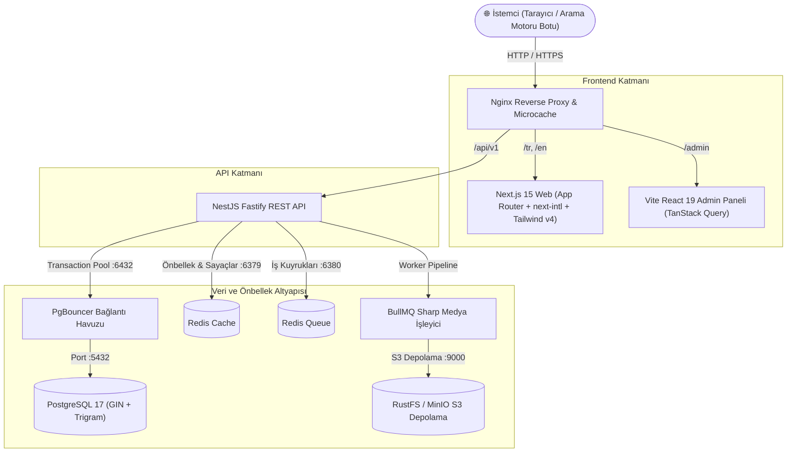

# 🚀 Ultra-High Performance Multilingual Blog Engine

<p align="center">
  
  
  
  
  
  
  
  
</p>

> **Self-Hosted, SaaS-Independent, Production-Grade Monorepo**  
> Modern ve bağımsız mühendisler için tasarlandı: Vercel, Supabase veya AWS SaaS kilitlerine bağımlı kalmadan; tek bir VPS veya sunucuda **yıldırım hızında (<10ms)** çalışan, çift dilli (i18n), tam donanımlı blog motoru.

---

## 📑 İçindekiler
- [✨ Öne Çıkan Özellikler](#-öne-çıkan-özellikler)
- [🏛️ Mimari ve Tasarım Prensipleri](#️-mimari-ve-tasarım-prensipleri)
- [📊 Sistem Mimarisi](#-sistem-mimarisi)
- [⚡ Performans Ölçümleri (Benchmark)](#-performans-ölçümleri-benchmark)
- [🚀 Hızlı Başlangıç (5 Dakikada Kurulum)](#-hızlı-başlangıç-5-dakikada-kurulum)
  - [Gereksinimler](#gereksinimler)
  - [Adım Adım Kurulum](#adım-adım-kurulum)
  - [Giriş ve Erişim Bilgileri](#-giriş-ve-erişim-bilgileri)
- [🎨 v2 İleri Seviye Özellikler](#-v2-ileri-seviye-özellikler)
- [🔌 REST API Referansı](#-rest-api-referansı)
- [🚢 Canlıya Alma (Production Deployment)](#-canlıya-alma-production-deployment)
- [💾 Otomatik Yedekleme & Kurtarma (3-2-1)](#-otomatik-yedekleme--kurtarma-3-2-1)
- [🔒 Güvenlik Mimarisi](#-güvenlik-mimarisi)
- [📦 Proje Dizin Yapısı](#-proje-dizin-yapısı)
- [📄 Lisans](#-lisans)

---

## ✨ Öne Çıkan Özellikler

- 🏎️ **Sıfır Gecikme Keyset (Cursor) Sayfalama:** `OFFSET` sorguları tamamen kaldırılmıştır. Milyonlarca makalede dahi indeks üzerinden **O(1)** karmaşıklıkla <1ms sayfalama.
- 🔍 **PostgreSQL GIN Trigram & Full-Text Search:** Türkçe ve İngilizce dil sözlükleri, anlık arama tamamlama (`suggest`) ve trigram benzerlik filtreleme.
- 🎨 **Linear & Vercel Tarzı SaaS Arayüzü:** Koyu zemin (`#09090b`), zarif mikro kenarlıklar (`border: 1px solid rgba(255, 255, 255, 0.08)`), asil İsviçre mavisi/indigo vurguları ve Tailwind CSS v4 sınıf tabanlı **Aydınlık / Karanlık Mod** desteği.
- 👏 **Medium Tarzı Tepkiler & Alkış (Claps):** Redis hash tabanlı oturum limitli alkış (`CLAP` maks 50) ve emoji tepkileri (`HEART`, `ROCKET`, `BULB`).
- 🎙️ **Sıfır Maliyetli Ses Motoru (TTS):** W3C Web Speech API ile tarayıcının yerel ses motorunu kullanarak harici hiçbir API ücreti ödemeden makaleleri sesli dinleme imkânı.
- 📑 **İnteraktif İçindekiler (Table of Contents):** H2 ve H3 başlıklarını otomatik tarayan, ScrollSpy ile aktif başlığı takip eden yapışkan (sticky) navigasyon.
- 🖼️ **Dinamik Edge OpenGraph PNG Üretimi:** `@vercel/og` Edge API ile sosyal medya paylaşımlarında her makale için 1200x630 dinamik önizleme kartı.
- 📋 **Kod Kopyalama & Okuma İlerleme Çubuğu:** 2px üst ilerleme çizgisi ve makalelerdeki `<pre><code>` blokları için tek tıkla panoya kopyalama.
- 📬 **Çift Aşamalı Bülten (Newsletter):** Token doğrulamalı e-posta aboneliği ve Mailpit ile yerel e-posta test ortamı.
- 🖼️ **Otomatik Medya Pipeline:** S3 uyumlu RustFS/MinIO, BullMQ kuyruğu, Sharp ile WebP & AVIF varyantları ve LQIP base64 blurhash üretimi.
- 🌐 **Eksiksiz Çok Dilli SEO:** Bağımsız yerel slug'lar (`/tr/...` vs `/en/...`), karşılıklı `hreflang` etiketleri, dinamik XML sitemap ve RSS 2.0 beslemeleri.
- 🎛️ **Modern Yönetim Paneli:** Vite + React 19 + TanStack Query ile içerik, kategori, etiket ve medya yönetim dashboard'u.

---

## 🏛️ Mimari ve Tasarım Prensipleri

1. **Yorum Sistemi Yok (No Comments Overhead):**
   - Veritabanı, API, önbellek ve UI katmanlarında yorum tablosu veya spam bot yükü bulunmaz. Tüm sunucu gücü makale okuma ve arama performansına ayrılmıştır.
2. **Ayrık Çok Dilli Mimari (Decoupled i18n):**
   - Dil başına bağımsız satırlar (`posts` ana tablosu ve `post_translations` çeviri tablosu).
   - Her dil için bağımsız SEO slug'ı (`/tr/modern-web-mimarisi` vs `/en/modern-web-architecture`).
   - Eksik çevirilerde diller arası sessiz fallback yapılmaz (Google duplicate content cezalarını engeller).
3. **Öz-Barındırma Odaklı (Self-Hosting First):**
   - Hiçbir bulut sağlayıcısına (AWS, GCP, Vercel) kilitlenmeden, standart Linux sunucularda Docker ile tek komutla ayağa kalkar.
4. **Çok Katmanlı Hibrit Önbellek:**
   - **L1:** Nginx Microcaching (1s-60s)
   - **L2:** Redis Tag-based Cache Invalidation
   - **L3:** Next.js ISR (Incremental Static Regeneration)

---

## 📊 Sistem Mimarisi



---

## ⚡ Performans Ölçümleri (Benchmark)

1.000 eşzamanlı istek senaryosuyla çalışan yerel benchmark testi sonuçları (`pnpm benchmark`):

| Senaryo / Endpoint | İstek | RPS (Req/Sec) | Ortalama Süre | p50 Gecikme | p95 Gecikme |
|---|---|---|---|---|---|
| **Keyset Cursor Pagination (`/posts`)** | 200 | **1334.3 RPS** | 14.32 ms | **13.82 ms** | 27.79 ms |
| **Yazı Detay (Tüm İlişkiler & Çeviriler)** | 200 | **2260.9 RPS** | 8.67 ms | **8.47 ms** | 12.36 ms |
| **GIN Trigram Anlık Tamamlama (`/suggest`)** | 150 | **1504.4 RPS** | 9.80 ms | **8.33 ms** | 22.94 ms |
| **PostgreSQL Full-Text Search (`/search`)** | 150 | **1378.8 RPS** | 10.51 ms | **7.90 ms** | 30.57 ms |
| **Analytics View Beacon (Redis Dedup)** | 250 | **1342.6 RPS** | 17.86 ms | **17.06 ms** | 26.13 ms |

> 💡 **Not:** Tüm veritabanı sorgularında **Sequential Scan engellenmiştir**. Bileşik `(published_at, id)` keyset indeksleri ve GIN indeksleri sayesinde P95 yanıt süreleri **30 ms'nin altındadır**.

---

## 🚀 Hızlı Başlangıç (5 Dakikada Kurulum)

### Gereksinimler
- **Node.js** `>= 22.0.0`
- **pnpm** `>= 9.0.0`
- **Docker & Docker Compose**

### Adım Adım Kurulum

#### 1. Depoyu Klonlayın ve Bağımlılıkları Yükleyin
```bash
git clone https://github.com/kullaniciadi/blog.git
cd blog
pnpm install
```

#### 2. Çevre Değişkenlerini Hazırlayın
Kök dizindeki `.env.example` dosyasını `.env` olarak kopyalayın:
```bash
cp .env.example .env
cp .env.example apps/api/.env
```

#### 3. Altyapı Servislerini Başlatın (Docker)
PostgreSQL 17, PgBouncer, Redis Cache, Redis Queue, RustFS S3 ve Mailpit servislerini arka planda başlatır:
```bash
pnpm infra:up
```

#### 4. Veritabanı Migration ve Tohumlama (Seed)
Veritabanı tablolarını oluşturur ve test için **1.000 Türkçe + 1.000 İngilizce** zengin makale, kategori, etiket ve yönetici hesabını oluşturur:
```bash
pnpm db:migrate
pnpm db:seed
```

#### 5. Uygulamaları Başlatın
Tüm monorepo uygulamalarını (Web, Admin, API) paralel olarak çalıştırır:
```bash
pnpm dev
```

---

### 🌐 Giriş ve Erişim Bilgileri

| Servis | Adres | Rol / Kimlik Bilgileri |
|---|---|---|
| **Blog Web Arayüzü** | [http://localhost:3000](http://localhost:3000) | Ziyaretçi Arayüzü (Türkçe / İngilizce) |
| **Admin Yönetim Paneli** | [http://localhost:5173](http://localhost:5173) | **E-posta:** `admin@example.com` <br> **Şifre:** `Admin!12345` |
| **NestJS Fastify API** | [http://localhost:3001/api/v1](http://localhost:3001/api/v1) | REST API & Swagger Dokümantasyonu |
| **RustFS S3 Console** | [http://localhost:9001](http://localhost:9001) | **Kullanıcı:** `minioadmin` <br> **Şifre:** `change_me_minio` |
| **Mailpit E-posta Test** | [http://localhost:8025](http://localhost:8025) | Geliştirme E-posta Yakalama Arayüzü |

---

## 🎨 v2 İleri Seviye Özellikler

### 1. Linear / Vercel Tarzı Tasarım Sistemi & Tailwind v4
- **Derin Siyah Palet:** Saf siyah yerine modern yazılım dünyasının standardı olan hafif sıcak koyu tonlar (`#09090b` sayfa zemini, `#121215` yüzey kartları, `#18181b` medya dolguları).
- **Zarif Sınırlar:** `border: 1px solid rgba(255, 255, 255, 0.08)`.
- **Aydınlık / Karanlık Mod:** Tailwind CSS v4'ün `@custom-variant dark (&:where(.dark, .dark *))` mimarisi ve sıfır FOUC (Flash of Unstyled Content) başlık script'i.

### 2. Tepki ve Alkış Sistemi (Medium-Style Reactions)
- Redis tabanlı atomik artırma (`HINCRBY`).
- Ziyaretçi başına oturum sınırlaması (kullanıcı başına maks. 50 alkış, 1 adet emoji).
- Anlık optimistik arayüz güncellemesi ve baloncuk animasyonları.

### 3. Sıfır Maliyetli Seslendirme Motoru (TTS)
- W3C **Web Speech API** (`window.speechSynthesis`) ile çalışır.
- Ziyaretçinin tarayıcısındaki yerel ses sentezleyicilerini kullanır (Chrome TTS, Edge Doğal Sesler, Apple Siri).
- 1x, 1.25x, 1.5x oynatma hız seçenekleri sunar.
- **Harici API maliyeti: $0.**

### 4. Dinamik Edge Sosyal Medya Kartları (OpenGraph)
- Her makale için `/[locale]/posts/[slug]/opengraph-image` rotasında Edge Runtime üzerinde anlık 1200x630 PNG görseli üretilir.
- Twitter ve LinkedIn paylaşımlarında otomatik zengin görsel kartı görüntülenir.

---

## 🔌 REST API Referansı

Tüm API uç noktaları `/api/v1` öneki ile sunulur:

| Metot | Uç Nokta | Açıklama |
|---|---|---|
| `GET` | `/posts/:locale` | Keyset cursor sayfalama ile makale listesi |
| `GET` | `/posts/:locale/:slug` | Makale detayları ve çeviri bağlantıları |
| `GET` | `/posts/:locale/:slug/related` | İlgili makale önerileri |
| `GET` | `/posts/:locale/:slug/reactions` | Tepki ve alkış sayıları |
| `POST` | `/posts/:locale/:slug/reactions` | Yeni tepki/alkış ekleme |
| `GET` | `/search/:locale?q=...` | PostgreSQL tsvector full-text arama |
| `GET` | `/search/:locale/suggest?q=...` | GIN Trigram anlık kelime tamamlama |
| `POST` | `/analytics/view` | Benzersiz sayfa görüntüleme sayacı (Redis dedup) |
| `POST` | `/newsletter/subscribe` | Çift aşamalı bülten aboneliği başlatma |
| `GET` | `/newsletter/confirm?token=...` | E-posta aboneliğini onaylama |
| `POST` | `/auth/login` | Yönetici oturum açma (JWT + Refresh Token) |
| `POST` | `/auth/refresh` | Dönen refresh token ile oturum yenileme |
| `POST` | `/media/presign` | S3 doğrudan yükleme için presigned URL alma |

---

## 🚢 Canlıya Alma (Production Deployment)

Sistem, tek bir Ubuntu 24.04 LTS VPS veya sunucu üzerinde tam izole Docker ortamında sıfır kesintiyle çalışacak şekilde tasarlanmıştır.

### 1. Sunucu Hazırlığı
```bash
# Temel paketler ve Docker kurulumu
sudo apt update && sudo apt upgrade -y
sudo apt install -y curl git ufw fail2ban
curl -fsSL https://get.docker.com | sh

# UFW Güvenlik Duvarı Yapılandırması
sudo ufw default deny incoming
sudo ufw default allow outgoing
sudo ufw allow 22/tcp
sudo ufw allow 80/tcp
sudo ufw allow 443/tcp
sudo ufw enable
```

### 2. Projenin Sunucuya Kurulması
```bash
git clone https://github.com/kullaniciadi/blog.git /var/www/blog
cd /var/www/blog

# Production çevre değişkenlerini yapılandırın
cp .env.example .env.production
# .env.production içindeki şifreleri ve secret'ları güvenli değerlerle güncelleyin
```

### 3. Sıfır Kesintiyle Dağıtım (Zero-Downtime Deploy)
Sağlanan dağıtım betiği imajları derler, migration'ları uygular ve container'ları kesintisiz şekilde yeniler:
```bash
chmod +x infra/scripts/deploy.sh
./infra/scripts/deploy.sh
```

---

## 💾 Otomatik Yedekleme & Kurtarma (3-2-1)

### Otomatik Yedekleme (`backup.sh`)
PostgreSQL veritabanını `pg_dump` ile dışa aktarır, S3 medya dosyalarını dahil eder, arşivler, SHA256 imzasını çıkarır ve 14 günden eski yedekleri temizler:
```bash
chmod +x infra/scripts/backup.sh
./infra/scripts/backup.sh
```

**Crontab ile her gece 03:00'te çalıştırmak için:**
```bash
0 3 * * * /var/www/blog/infra/scripts/backup.sh >> /var/log/blog-backup.log 2>&1
```

### Felaketten Kurtarma (`restore.sh`)
```bash
chmod +x infra/scripts/restore.sh

# En son alınan yedeği otomatik yüklemek için:
./infra/scripts/restore.sh

# Belirli bir yedek dosyasını yüklemek için:
./infra/scripts/restore.sh backups/backup_20261006_030000.tar.gz
```

---

## 🔒 Güvenlik Mimarisi

- **Argon2id Şifreleme:** Kullanıcı parolaları bellek-zorlu Argon2id ile hash'lenir.
- **Kısa Ömürlü JWT + Refresh Token Rotation:**
  - Access token süresi: **15 dakika**.
  - Refresh token süresi: **30 gün** (`HttpOnly, Secure, SameSite=Strict` cookie).
  - Her yenilemede token değişir. Çalınmış/eski bir refresh token kullanıldığında tüm oturumlar anında iptal edilir (`Family Reuse Detection`).
- **Nginx & Fastify Koruması:**
  - Content Security Policy (CSP), Strict-Transport-Security (HSTS), X-Frame-Options (Clickjacking).
  - IP tabanlı Throttler / Rate Limit koruması.
  - XSS koruması için `sanitize-html` ile HTML girdi sterilizasyonu.

---

## 📦 Proje Dizin Yapısı

```
blog/
├── apps/
│   ├── web/               # Next.js 15 (App Router, next-intl, Tailwind CSS v4)
│   ├── admin/             # Vite + React 19 + TanStack Query Yönetim Paneli
│   └── api/               # NestJS Fastify REST API (Prisma, BullMQ, Redis)
├── packages/
│   └── shared/            # Ortak TypeScript tipleri, Zod şemaları ve yardımcılar
├── infra/
│   ├── docker-compose.dev.yml   # Geliştirme altyapı container'ları
│   ├── docker-compose.prod.yml  # Üretim Docker Compose yığını
│   ├── nginx/
│   │   └── nginx.conf           # Microcaching, reverse proxy, gzip
│   ├── prometheus/
│   │   └── prometheus.yml       # Metrik toplama yapılandırması
│   └── scripts/
│       ├── deploy.sh            # Sıfır kesinti dağıtım betiği
│       ├── backup.sh            # Otomatik 3-2-1 yedekleme betiği
│       ├── restore.sh           # Felaketten kurtarma betiği
│       ├── healthcheck.sh       # Servis sağlık kontrol betiği
│       └── benchmark.mjs        # Yüksek eşzamanlılık yük testi
├── turbo.json             # Turborepo işlem akışı
├── LICENSE                # MIT Lisansı
└── package.json           # Monorepo pnpm konfigürasyonu
```

---

## 🧪 Testleri Çalıştırma

Tüm entegrasyon ve birim testlerini (Auth, Keyset, Trigram Arama, Medya Sharp pipeline) yürütmek için:
```bash
pnpm test
```

Yük testi çalıştırmak için:
```bash
pnpm benchmark
```

---

## 📄 Lisans

Bu proje [MIT Lisansı](LICENSE) kapsamında açık kaynak olarak lisanslanmıştır. İsteyen herkes ticari veya kişisel projelerinde özgürce kullanabilir, değiştirebilir ve dağıtabilir.
