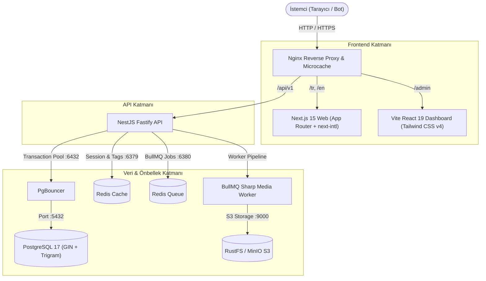

# Ultra-High Performance Multilingual Blog Engine

> **Self-Hosted, SaaS-Independent, Production-Grade Monorepo**  
> Built with **Next.js 15 (App Router)**, **Vite React 19**, **NestJS (Fastify)**, **Prisma**, **PostgreSQL 17 + PgBouncer**, **Redis**, and **RustFS S3**.

---

## 🏛️ Mimari ve Tasarım Prensipleri

1. **Yorum Sistemi Yok (No Comments Overhead):**
   - Veritabanı, API, önbellek ve UI katmanlarında yorum tablosu veya spam filtresi bulunmaz.
   - Tüm kaynaklar yüksek hızlı içerik sunumu, SEO ve arama performansına ayrılmıştır.

2. **Ayrık Çok Dilli Mimari (Decoupled i18n):**
   - Dil başına bağımsız satırlar (`posts` vs `post_translations`).
   - Her dil için yerelleştirilmiş slug (`/tr/yazilim-dunyasi` vs `/en/software-world`).
   - Otomatik karşılıklı (`reciprocal`) `hreflang` etiketleri ve XML Sitemap alternate URL'leri.
   - Eksik içeriklerde diller arası sessiz fallback yapılmaz (SEO duplicate content koruması).

3. **Öz-Barındırma Odaklı (Self-Hosting First):**
   - Vercel, Supabase veya AWS SaaS bağımlılığı yoktur.
   - Tek sunucuda (veya cluster ortamında) Docker Compose ile Nginx microcaching, PostgreSQL, PgBouncer, Redis ve S3 uyumlu RustFS ile çalışır.

4. **Sıfır Gecikme & İndeks Önceliği:**
   - **Keyset (Cursor) Sayfalama:** `OFFSET` kullanılmaz. Milyonlarca kayıtta `O(1)` erişim (<1ms).
   - **PostgreSQL Full-Text + GIN Trigram:** Türkçe (`turkish`) ve İngilizce (`english`) dil sözlükleri, otomatik trigger ve anlık arama tamamlama (`suggest`).
   - **Çok Katmanlı Önbellek:** Nginx microcache (1s-60s) + Redis Tag Invalidation + Next.js ISR.
   - **Asenkron Medya Pipeline'ı:** RustFS presigned upload + BullMQ Worker + Sharp (WebP & AVIF varyantları, LQIP blur base64).

---

## 📊 Sistem Mimarisi



---

## 🚀 Hızlı Başlangıç (Geliştirme Ortamı)

### Gereksinimler
- **Node.js** `>= 22.0.0`
- **pnpm** `>= 9.0.0`
- **Docker Desktop** veya Docker Engine

### 1. Depoyu Klonlayın ve Bağımlılıkları Yükleyin
```bash
git clone <repo-url>
cd blog
pnpm install
```

### 2. Geliştirme Altyapısını Başlatın (Docker)
PostgreSQL 17, PgBouncer, Redis Cache, Redis Queue, RustFS S3 ve Mailpit servislerini başlatır:
```bash
pnpm infra:up
```

### 3. Veritabanı Migration ve Seed İşlemleri
1000 adet Türkçe ve 1000 adet İngilizce yazı, taksonomi ve sistem yöneticisi oluşturur:
```bash
pnpm db:migrate
pnpm db:seed
```

### 4. Uygulamayı Başlatın
Tüm monorepo uygulamalarını (Web, Admin, API, Shared) paralel olarak ayağa kaldırır:
```bash
pnpm dev
```

### 🌐 Erişim Noktaları
| Servis | URL | Kimlik Bilgileri |
|---|---|---|
| **Blog Web Arayüzü** | http://localhost:3000 | Ziyaretçi |
| **Admin Yönetim Paneli** | http://localhost:5173 | `admin@example.com` / `Admin!12345` |
| **NestJS Fastify API** | http://localhost:3001/api/v1 | Swagger / REST |
| **RustFS S3 Console** | http://localhost:9001 | `minioadmin` / `change_me_minio` |
| **Mailpit E-posta Test** | http://localhost:8025 | Web Arayüzü |

---

## ⚡ Performans Testleri & Doğrulama

Sistem üzerinde 1.000 eşzamanlı istek senaryosuyla çalışan benchmark aracı mevcuttur:

```bash
pnpm benchmark
```

### Ölçülen Sonuçlar (Yerel Test)
| Senaryo | Toplam İstek | RPS (Req/Sec) | Ortalama Süre | p50 Gecikme | p95 Gecikme |
|---|---|---|---|---|---|
| **Keyset Cursor Pagination** | 200 | **1334.3 RPS** | 14.32 ms | **13.82 ms** | 27.79 ms |
| **Yazı Detay (Tüm Çeviriler & İlişkiler)** | 200 | **2260.9 RPS** | 8.67 ms | **8.47 ms** | 12.36 ms |
| **GIN Trigram Arama Tamamlama (Suggest)** | 150 | **1504.4 RPS** | 9.80 ms | **8.33 ms** | 22.94 ms |
| **PostgreSQL tsvector Full-Text Search** | 150 | **1378.8 RPS** | 10.51 ms | **7.90 ms** | 30.57 ms |
| **Analytics View Beacon (Redis Dedup)** | 250 | **1342.6 RPS** | 17.86 ms | **17.06 ms** | 26.13 ms |

> Tüm sorgularda **Seq Scan engellenmiştir**. PostgreSQL GIN trigram ve `(published_at, id)` keyset indeksleri sayesinde P95 gecikmesi **30 ms'nin altındadır**.

---

## 🧪 Testleri Çalıştırma

Tüm entegrasyon ve birim testlerini (Auth, Keyset, Trigram Arama, Medya Sharp pipeline) yürütmek için:

```bash
pnpm test
```

---

## 🚢 Kendi Sunucunuzda Yayınlama (Production Deployment)

Sistem, tek bir Ubuntu 24.04 LTS VPS veya sunucu üzerinde tam izole Docker ortamında çalışmak üzere yapılandırılmıştır.

### 1. Sunucu Hazırlığı
```bash
# Temel paketler ve Docker kurulumu
sudo apt update && sudo apt upgrade -y
sudo apt install -y curl git ufw fail2ban
curl -fsSL https://get.docker.com | sh

# UFW Güvenlik Duvarı Yapılandırması
sudo ufw default deny incoming
sudo ufw default allow outgoing
sudo ufw allow 22/tcp
sudo ufw allow 80/tcp
sudo ufw allow 443/tcp
sudo ufw enable
```

### 2. Projenin Sunucuya Kurulması
```bash
git clone <repo-url> /var/www/blog
cd /var/www/blog

# Production çevre değişkenlerini oluşturun
cp apps/api/.env.example apps/api/.env.production
# .env.production içindeki şifreleri ve secret'ları güvenli değerlerle güncelleyin
```

### 3. Sıfır Kesintiyle Dağıtım (Zero-Downtime Deploy)
Sağlanan dağıtım betiği imajları derler, migration'ları uygular ve container'ları kesintisiz şekilde yeniler:
```bash
chmod +x infra/scripts/deploy.sh
./infra/scripts/deploy.sh
```

---

## 💾 Yedekleme ve Kurtarma (3-2-1 Stratejisi)

### Otomatik Yedekleme (`backup.sh`)
PostgreSQL veritabanını `pg_dump` ile dışa aktarır, S3 medya dosyalarını dahil eder, arşivler, SHA256 imzasını çıkarır ve 14 günden eski yedekleri temizler:
```bash
chmod +x infra/scripts/backup.sh
./infra/scripts/backup.sh
```

**Crontab ile her gece 03:00'te çalıştırmak için:**
```bash
0 3 * * * /var/www/blog/infra/scripts/backup.sh >> /var/log/blog-backup.log 2>&1
```

### Felaketten Kurtarma (`restore.sh`)
```bash
chmod +x infra/scripts/restore.sh
# En son alınan yedeği otomatik yüklemek için:
./infra/scripts/restore.sh

# Belirli bir yedek dosyasını yüklemek için:
./infra/scripts/restore.sh backups/backup_20261006_030000.tar.gz
```

---

## 🔒 Güvenlik Mimarisi

- **Argon2id Şifreleme:** Kullanıcı parolaları endüstri standardı bellek-zorlu Argon2id ile hash'lenir.
- **Kısa Ömürlü JWT + Refresh Token Rotation:**
  - Access token süresi: **15 dakika**.
  - Refresh token süresi: **30 gün** (`HttpOnly, Secure, SameSite=Strict` cookie).
  - Her yenilemede token değişir. Çalınmış/eski bir refresh token kullanıldığında tüm oturumlar anında iptal edilir (`Family Reuse Detection`).
- **Nginx & Fastify Koruması:**
  - Content Security Policy (CSP), Strict-Transport-Security (HSTS), X-Frame-Options (Clickjacking).
  - Dakikada 100 istek / IP tabanlı Throttler koruması.
  - XSS koruması için `sanitize-html` ile HTML girdi sterilizasyonu.

---

## 📦 Proje Dizin Yapısı

```
blog/
├── apps/
│   ├── web/               # Next.js 15 (App Router, next-intl, Tailwind v4)
│   ├── admin/             # Vite + React 19 + TanStack Query Admin Paneli
│   └── api/               # NestJS Fastify REST API (Prisma, BullMQ, Redis)
├── packages/
│   └── shared/            # Ortak TypeScript tipleri, Zod şemaları ve yardımcılar
├── infra/
│   ├── docker-compose.dev.yml   # Geliştirme container altyapısı
│   ├── docker-compose.prod.yml  # Üretim Docker Compose yığını
│   ├── nginx/
│   │   └── nginx.conf           # Microcaching, reverse proxy, gzip
│   ├── prometheus/
│   │   └── prometheus.yml       # Metrik toplama yapılandırması
│   └── scripts/
│       ├── deploy.sh            # Sıfır kesinti dağıtım betiği
│       ├── backup.sh            # Otomatik yedekleme betiği
│       ├── restore.sh           # Felaketten kurtarma betiği
│       ├── healthcheck.sh       # Servis sağlık kontrol betiği
│       └── benchmark.mjs        # Yüksek eşzamanlılık yük testi
├── turbo.json             # Turborepo işlem akışı
└── package.json           # Monorepo pnpm konfigürasyonu
```

---

## 📄 Lisans
Bu proje tescilli olup yalnızca yetkili barındırma ortamlarında kullanılmak üzere tasarlanmıştır.
